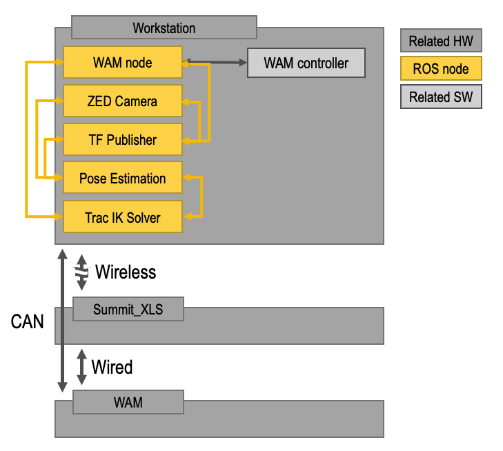

# BarretWamArm
Meta Package for tools to use our Barrett Wam Arm in simulation and with hardware.

# ROS Architecture
Here is an overview of our Architecture.


# Object Pose for Grasping

There are four main coordinate frames are used to grasp an object.

1. Base link of the manipulator

2. Camera Frame

    This is a dynamic transform as we mounted our camera on our arm. See barrett_tf_publisher.
     
3. Object Frame
    
    The 6-DoF pose was determined either using marker-based methods, such as [aruco_ros](https://github.com/pal-robotics/aruco_ros), or using deep learning, such as [DOPE](https://github.com/NVlabs/Deep_Object_Pose) or [DenseFusion](https://github.com/j96w/DenseFusion).
    
4. End Effector Frame

    We used a 8-DoF Barrett Hand. Which has +/- 17.5cm from tip to the center of the palm. Note that two-finger grippers require the object pose to be accurate within +/- 2cm.
    
Ultimately, we need to align the end effector frame to the pose of the object w.r.t. base link of the manipulator.


# Launch in Simulation

Simulation tools were developed to improve and/or debug software packages used in demos and/or grasping experiments. 

1. First, launch Gazebo.

    ```roslaunch barrett_wam_arm_control barrett_wam_arm_control.launch```
    
    ```roslaunch barrett_wam_arm_sim empty_world.launch```
    
2. Launch TF Publisher.

    ```roslaunch tf_publisher tf_publisher_sim.launch```
    
3. Afterwards, RGB-D images were played back from the [ARL AffPose Dataset](https://github.com/UW-Advanced-Robotics-Lab/arl-affpose-dataset-utils). A 6-DoF pose was used to command the robot using trac ik in simulation.

    ```roslaunch trac_ik barrett_trac_ik_arl_affpose_simple.launch```

# Launch for ArUco Demo
1. First, ensure that the Barrett WAM arm is calibrated. 

    ```bt-zero-cal```

2. Launch the WAM node.

    ```roslaunch wam_node wam_node.launch```

3. Launch ZED camera.

    ```roslaunch zed_ros_wrapper zed.launch```

4. Launch TF Publisher.

    ```roslaunch tf_publisher tf_publisher.launch```
    
5. Launch ArUco Node. 

    ```roslaunch aruco_ros single.launch```
    
6. Launch Trac IK. 

    ```roslaunch trac_ik demo.launch```
