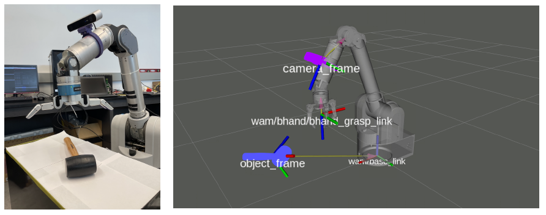

### Object Pose for Grasping

There are four main coordinate frames are used to grasp an object: 
1. base link of the manipulator
2. camera frame
3. object frame
4. end effector frame

Note that the camera frame is a dynamic transform as we mounted our camera on our arm.

Note the object frame was determined either using marker-based methods, such as [aruco_ros](https://github.com/pal-robotics/aruco_ros), or using deep learning, such as [DOPE](https://github.com/NVlabs/Deep_Object_Pose) or [DenseFusion](https://github.com/j96w/DenseFusion).
    
Note that we used a 8-DoF Barrett Hand for the end effector frame. Which has +/- 17.5cm from tip to the center of the palm. Note that two-finger grippers require the object pose to be accurate within +/- 2cm.

